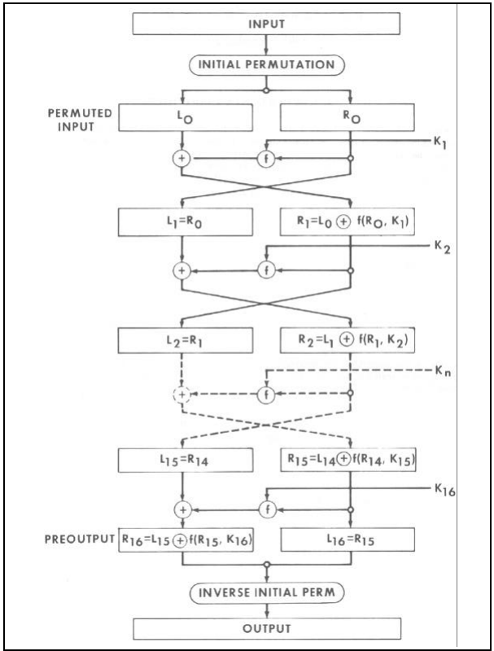
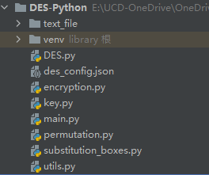
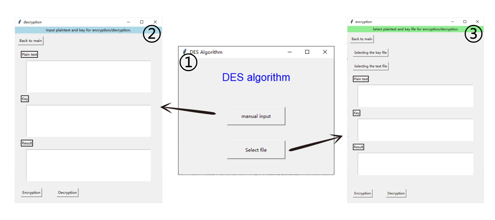
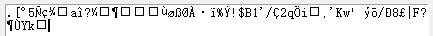
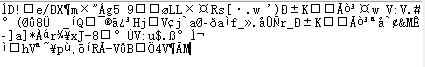
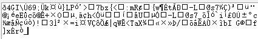
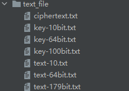

# DES Algorithm Implementation

## Projects

This project implements the DES (Data Encryption Standard) algorithm written in Python, including encryption and decryption functions. The user can interact with the programme using a GUI. Encryption and decryption are two separate parts and both require a key to use these functions.

## Algorithm overview



### IP replacement

The 64-bit plaintext is rearranged by permutation with the initial IP matrix

### 16 rounds of iterations

#### rotation function

The wheel function is the core part of the whole algorithm and consists of four steps respectively

1. E-Extension: the extension of a 32-bit half-block of data to 48 bits is done by a fixed E-substitution table. This step increases the complexity of the data for mixing with subkeys.
2. Dissimilarity: dissimilarity operation between the 48-bit data after E expansion and the subkey used in the round. The generation of the subkey is one of the key steps in the DES algorithm and is usually generated from the master key.
3. S-box compression processing: 48-bit data is divided into eight 6-bit blocks and each block is passed to eight different S-boxes (S1 to S8). Each S-box maps 6-bit inputs to 4-bit outputs, reducing the amount of data while increasing nonlinearity.
4. P permutation: the 32-bit data from the S-box processing is rearranged through a P permutation table to produce the final 32-bit output.

#### different or alternative

The 32bit data derived from the wheel function is then differentiated from the 32bit data in the left half.

### inverse IP replacement

The data obtained after 16 rounds of iteration is permuted using the inverse of the IP matrix to obtain the encrypted cipher text.

### declassification

The decryption process is similar to the encryption process, but the order of the subkeys used in the wheel function is reversed. Specifically:

- Decryption begins with a round function operation using subkeys in the reverse order of encryption.
- At the end of each round, the 32-bit data obtained from the round function is subjected to an iso-ortho operation with the 32-bit data of the right half in order to be combined with the left half in the next round.
- After decryption, inverse IP substitution is performed, where the data after 16 rounds of iteration is rearranged using the inverse IP matrix to obtain the decrypted plaintext.

## computer programming

### algorithmic principle

#### Implementation steps

After plaintext is entered or read from a file, it is first converted to binary format. When performing plaintext preprocessing prior to DES encryption, if the length is less than 64 bits, zeros are added to the binary plaintext to fill it up to 64 bits. If the length is greater than 64 bits, the binary plaintext is truncated in groups of 64 bits and the shortfall is filled with zeros to form a 64-bit list of plaintext fragments. Unlike processing plaintext, I took a different approach to the key. I chose to use a hash function to hash keys larger than 64 bits to obtain a 64-bit binary key. This key is passed into the key generation function, and 16 48-bit binary subkeys are obtained by substituting PC1 and PC2 and an iterative left shift in between the two substitutions.

Next, DES encryption is performed on each 64-bit fragment in the loop. First, the 64-bit binary plaintext undergoes IP substitution and then enters 16 rounds of iterations. In each round of iteration, the wheel function and the dissimilarity operation of the left and right fragments are included. In the round function, the right 32-bit binary plaintext will be converted to 48 bits after E-extension, and then performs the dissimilarity operation with the subkey corresponding to the current iteration. Then, it undergoes S-box compression back to 32 bits and finally P substitution. After the processing is completed, the dissimilarity operation is performed with the left 32-bit binary plaintext.16 rounds later, the left and right 32-bit binary plaintexts are exchanged, and finally the IP inverse substitution operation is performed to obtain the final ciphertext.

The decryption operation is basically the same, the only difference is that the order of the subkeys is reversed in 16 iterations.

#### permutation

Substitution operations are widely used in DES algorithms, including the initial IP substitution and the final IP inverse substitution, as well as the P substitution in the round function in 16 iterations, and also the PC1 and PC2 substitutions in the key generation process. The principle of these operations is to achieve the function of encrypting or removing the detection bits by rearranging the order of the data bits. The following are the functions for the substitution operations.

```python
def permutation(source, matrix_name):
    with open("des_config.json", "r") as config_file:
        config = json.load(config_file)
    # Read initial permutation matrix from json file
    matrix = config[matrix_name]

    # Substitution of inputs by initial substitution matrices
    output = []
    for row in matrix:
        for colum in row:
            output.append(source[colum - 1])
    return ''.join(output)
```

#### Key Generation

Key generation is the key aspect of the algorithm, which generates a series of subkeys from the master key, which are used to encrypt the plaintext in a 16 iteration process. This process starts by removing 8 parity bits by PC1 substitution, followed by performing a cyclic left shift operation based on a predefined table of shift counts, and finally obtaining 16 subkeys of 48 bits by PC2 substitution. The important point to note is that each subkey is obtained by left-shifting on top of the previous key. A list of all subkeys can be obtained by key generation.

```python
keys = []
# Replacement option PC1
calculate_key = permutation(key, "PC1")
for iteration in range(16):
    # Iterative left shift
    c = calculate_key[:28]
    d = calculate_key[28:]

    left_shift_number = left_shift[iteration]
    left_part = c[left_shift_number:] + c[:left_shift_number]
    right_part = d[left_shift_number:] + d[:left_shift_number]

    # Combining left and right parts
    shifted_key = left_part + right_part

    # Replacement option PC2
    output_key = permutation(shifted_key, "PC2")

    # iterative assignment
    calculate_key = shifted_key

    # Storing the subkey
    keys.append(output_key)
```

In this section I modified a few things, since the key length provided by the user is not fixed, I modified the hash algorithm to reprocess the key to get a 64-bit key.

```python
def custom_hash_key_to_64_bits(key):
    # SHA-256 hash it, then extend the hash to 64-bit binary numbers.
    sha256 = hashlib.sha256()
    sha256.update(key.encode('utf-8'))
    hashed_key = sha256.digest()

    # If the length of the hash result is less than 64 bits,
    # fill its left side with zeros until it reaches 64 bits
    if len(hashed_key) < 8:
        padded_hash = b'\x00' * (8 - len(hashed_key)) + hashed_key
    else:
        padded_hash = hashed_key[:8]
    return padded_hash
```

#### E Expansion

By operating with a fixed permutation table, the 32-bit data is divided into eight groups, while one bit of data is added before and after each group. The last bit of each group is the front add of the next group, while the first bit of each group is the back add of the previous group. This is easily done by a substitution operation.

```python
def extended(source):
    # E Expansion to expand 32bit data to 48bit
    output = permutation(source, "e_matrix")
    return output
```

#### differentiation or alternative calculation

When performing the dissimilarity calculation, the same bits in the two vectors have a value of 0 and the different bits have a value of 1, thus generating a new vector.

```python
def xor_with_key(source, the_key):
    # performs the different-or operation
    result = ""
    for i in range(len(source)):
        # Different-or each bit of data and key
        if source[i] != the_key[i]:
            result += "1"
        else:
            result += "0"
    return result
```

#### S-box compression

The 32-bit data is obtained by applying the extended 48-bit plaintext to the 48-bit key and then compressing it using 8 S-boxes.

The following is the code for individual S-box compression

```python
def s_box_compression(bits, s_box_name):
    if len(bits) != 6:
        raise ValueError("Input bits must be 6 bits long")
    with open("des_config.json", "r") as config_file:
        config = json.load(config_file)

    # Read the corresponding s box
    s_box = config[s_box_name]

    # Calculate the number of rows and columns obtained
    row = utils.decimal_conversion(bits[0] + bits[5])
    col = utils.decimal_conversion(bits[1:5])

    # Corresponding figures obtained against the S box table
    s_box_value = s_box[int(row)][int(col)]
    output = utils.binary_conversion(s_box_value)
    
    # Fill operation when converted to a binary number with less than four bits
    if len(output) != 4:
        padding_length = 4 - len(output)
        output = "0" * padding_length + output
    return output
```


### code structure



- DES.py: Master file of the DES algorithm implementation, including encryption and decryption functions.
- encryption.py: Includes the body of the wheel function and the E extension
- key.py: Documentation for generating subkeys, including hash functions and subkey generation functions
- main.py: GUI startup files, including calls to DES functions and definitions of the GUI layout and button functionality
- permutation.py: Include permutation functions
- substitution_boxes.py: Includes S-box compression function
- utils.py: Documentation of helper functions, including binary conversion, iso, and string preprocessing
- des_config.json: Store the defined correlation matrix (IP, IP-1, P, PC1, PC2...)
- text_file: Stores the key and text files for testing, and the encrypted ciphertext file.

### GUI interface

#### Page Introduction

1. Main interface: consists of two buttons (manual input and selection of files to upload)
2. Manual input encryption interface: You need to manually input plaintext and ciphertext to encrypt and decrypt.
3. Upload file encryption page: You can upload plaintext files and key files for encryption and decryption.

#### Operation Introduction

- Manual input encryption：
  1. Input plaintext
  2. Enter the key
  3. Click the Encrypt or Decrypt button
- Upload file encryption：
  1. Select key file and plaintext file
  2. Click the Encrypt or Decrypt button

## Test Methods

### Manual Input Test

1. **Test the plaintext:** This is a test to see if my DES encryption algorithm is correct. (64-bit)

   **Test key:** 123456789

   **Secret Text:** 

   **Decipher the plain text:** This is a test to see if my DES encryption algorithm is correct.

2. **Test the plaintext:** This is a test to see if my DES encryption algorithm is correct. It is used to test the encryption and decryption function of the detection algorithm. This is longer than 64 bits. (179-bit)

   **Test key:** 5792168340956831247609812543067891234560987132456789012345678901 (64-bit key)

   **Secret Text:** 

   **Decipher the plain text:** This is a test to see if my DES encryption algorithm is correct. It is used to test the encryption and decryption function of the detection algorithm.

3. **Test the plaintext:** This is a test to see if my DES encryption algorithm is correct. It is used to test the encryption and decryption function of the detection algorithm. This is longer than 64 bits.

   **Test key:** 57921683409568312476098125430678912345609871324567890123456789011234 (68-bit key)

   **Secret Text:** 

   **Decipher the plain text:** This is a test to see if my DES encryption algorithm is correct. It is used to test the encryption and decryption function of the detection algorithm. This is longer than 64 bits.

### Select file upload test

The text_file subfolder under the project contains the key and text files for testing.



Among them, ciphertext.txt is the file to store the ciphertext after encryption, which is used to verify whether the encryption function is correct. After selecting a key file as well as a plaintext file to upload and clicking the Encrypt button, the encrypted ciphertext will be stored in ciphertext.txt, at this time you can click the Upload Plaintext File button to upload ciphertext.txt as a plaintext file, then click the Decrypt button to verify if the encryption is correct as well as whether the decryption is correct or not. I can verify the correctness of my procedure by testing both.


