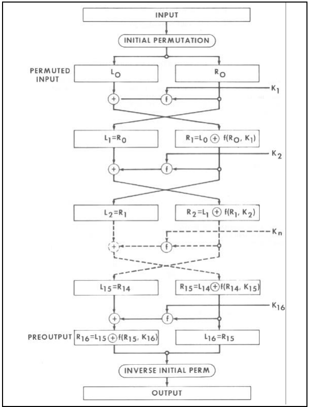
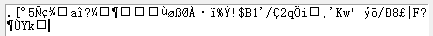

# DES 算法实现

## 项目介绍

本项目实现了使用Python编写的DES（Data Encryption Standard）算法，包括加密和解密功能。使用者可以使用GUI来与程序进行交互。加密与解密是两个独立的部分并且都需要密钥来使用这些功能。

## 算法概述



### IP置换

通过与初始IP矩阵进行置换，将64位明文重新排列组合

### 16轮矩阵迭代

#### 轮函数

轮函数是整个算法中核心的部分，包括四个步骤分别是

1. E扩展：将32位的半块数据扩展为48位，通过一个固定的E置换表完成。这一步增加了数据的复杂性，以便与子密钥进行混合。
2. 异或：将E扩展后的48位数据与该轮使用的子密钥进行异或操作。子密钥的生成是DES算法中的关键步骤之一，通常从主密钥中生成。

3. S盒压缩处理：将48位数据分成8个6位块，并将每个块传递给8个不同的S盒（S1至S8）。每个S盒都映射6位输入到4位输出，减小了数据量，同时增加了非线性。

4. P置换：将S盒处理后的32位数据通过一个P置换表进行重新排列，以产生最终的32位输出。

#### 异或

将从轮函数中得出的32bit数据再与左半部分32bit数据进行异或操作

### 逆IP置换

使用IP矩阵的逆对16轮迭代后获得的数据进行置换，得到加密后的密文

### 解密

解密过程与加密过程相似，但在轮函数中使用的子密钥的顺序颠倒。具体来说：

- 解密开始时，使用与加密相反顺序的子密钥进行轮函数操作。
- 在每一轮结束后，将轮函数得到的32位数据与右半部分32位数据进行异或操作，以便在下一轮中与左半部分进行组合。
- 解密结束后，进行逆IP置换，使用逆IP矩阵将16轮迭代后的数据重新排列，以获得解密后的明文。

## 程序设计

### 算法原理

#### 实现步骤

在明文输入或从文件读取后，首先将其转换为二进制格式。进行DES加密前的明文预处理时，如果长度小于64位，则在二进制明文前添加0以补充至64位。如果长度大于64位，则将二进制明文以64位一组截断，不足部分用0填充，形成64位的明文片段列表。与处理明文不同，我对密钥的处理采用了不同的方法。我选择使用哈希函数对大于64位的密钥进行哈希，从而获得64位的二进制密钥。将这个密钥传入密钥生成函数，通过PC1和PC2的置换以及两次置换中间的迭代左移，得到16个48位的二进制子密钥。

接下来，在循环中对每个64位片段进行DES加密。首先，64位二进制明文会经过IP置换，然后进入16轮迭代。在每轮迭代中，包括轮函数和左右片段的异或操作。在轮函数中，右侧32位二进制明文会经过E扩展转换为48位，然后与当前迭代所对应的子密钥进行异或操作。接着，经过S盒压缩回到32位，最后进行P置换。处理完成后，与左侧32位二进制明文进行异或操作。16轮后，将左右侧32位二进制明文进行位置交换，最后进行IP逆置换操作，得到最终的密文。

解密操作基本相同，唯一的区别在于16次迭代时子密钥的使用顺序颠倒。

#### 置换操作

在DES算法中，置换操作被广泛应用，包括初始的IP置换和最后的IP逆置换，以及在16次迭代中轮函数中的P置换，还包括在密钥生成过程中的PC1和PC2置换。这些操作的原理是通过重新排列数据位的顺序，以实现加密或去除检测位的功能。如下是置换操作的函数。

```python
def permutation(source, matrix_name):
    with open("des_config.json", "r") as config_file:
        config = json.load(config_file)
    # Read initial permutation matrix from json file
    matrix = config[matrix_name]

    # Substitution of inputs by initial substitution matrices
    output = []
    for row in matrix:
        for colum in row:
            output.append(source[colum - 1])
    return ''.join(output)
```

#### 密钥生成

密钥生成是该算法的关键环节，它通过主密钥生成一系列子密钥，在16次迭代过程中用于加密明文。这个过程首先通过PC1置换来删除8个校验位，接着根据预定的位移次数表执行循环左移操作，最后再通过PC2置换来获取16个48位的子密钥。其中要注意的点是每一个子密钥的获得都是在上一个密钥的基础上进行左移获得。通过密钥生成可以得到一个包含所有子密钥的列表。

```python
keys = []
# Replacement option PC1
calculate_key = permutation(key, "PC1")
for iteration in range(16):
    # Iterative left shift
    c = calculate_key[:28]
    d = calculate_key[28:]

    left_shift_number = left_shift[iteration]
    left_part = c[left_shift_number:] + c[:left_shift_number]
    right_part = d[left_shift_number:] + d[:left_shift_number]

    # Combining left and right parts
    shifted_key = left_part + right_part

    # Replacement option PC2
    output_key = permutation(shifted_key, "PC2")

    # iterative assignment
    calculate_key = shifted_key

    # Storing the subkey
    keys.append(output_key)
```

在这一部分我修改了一些东西，因为用户提供的密钥长度不固定，所以我修改了哈希算法对密钥进行再加工，从而获得64位的密钥。

```python
def custom_hash_key_to_64_bits(key):
    # SHA-256 hash it, then extend the hash to 64-bit binary numbers.
    sha256 = hashlib.sha256()
    sha256.update(key.encode('utf-8'))
    hashed_key = sha256.digest()

    # If the length of the hash result is less than 64 bits,
    # fill its left side with zeros until it reaches 64 bits
    if len(hashed_key) < 8:
        padded_hash = b'\x00' * (8 - len(hashed_key)) + hashed_key
    else:
        padded_hash = hashed_key[:8]
    return padded_hash
```

#### E扩展

通过与一个固定置换表进行操作，将32位数据分为八组，同时在每组前后各添加一个比特数据。每组的最后一个比特是下一组的前置添加，而每组的第一个比特是上一组的后置添加。通过置换操作很容易做到这一点。

```python
def extended(source):
    # E Expansion to expand 32bit data to 48bit
    output = permutation(source, "e_matrix")
    return output
```

#### 异或计算

进行异或计算时，两个向量中相同的位值为0，不同的位值为1，从而生成一个新的向量。

```python
def xor_with_key(source, the_key):
    # performs the different-or operation
    result = ""
    for i in range(len(source)):
        # Different-or each bit of data and key
        if source[i] != the_key[i]:
            result += "1"
        else:
            result += "0"
    return result
```

#### S盒压缩

通过将扩展得来的48位明文与48位密钥进行异或运算后，再使用8个S盒压缩处理得到32位数据。

以下是在进行单独S盒压缩的代码

```python
def s_box_compression(bits, s_box_name):
    if len(bits) != 6:
        raise ValueError("Input bits must be 6 bits long")
    with open("des_config.json", "r") as config_file:
        config = json.load(config_file)

    # Read the corresponding s box
    s_box = config[s_box_name]

    # Calculate the number of rows and columns obtained
    row = utils.decimal_conversion(bits[0] + bits[5])
    col = utils.decimal_conversion(bits[1:5])

    # Corresponding figures obtained against the S box table
    s_box_value = s_box[int(row)][int(col)]
    output = utils.binary_conversion(s_box_value)
    
    # Fill operation when converted to a binary number with less than four bits
    if len(output) != 4:
        padding_length = 4 - len(output)
        output = "0" * padding_length + output
    return output
```


### 代码结构


- DES.py: DES 算法实现的主文件，包括加密以及解密函数
- encryption.py: 包括轮函数主体以及E扩展
- key.py: 生成子密钥的文件，包括hash函数以及子密钥生成函数
- main.py: GUI启动文件，包括对DES函数的调用以及GUI的布局和按钮功能的定义
- permutation.py: 包含置换函数
- substitution_boxes.py: 包含S盒压缩函数
- utils.py: 辅助函数文件，包括二进制转换，异或，和对字符串的预处理
- des_config.json: 存储定义的相关矩阵（IP, IP-1, P, PC1, PC2...)
- ciphertext.txt: 用于存储密文 

### GUI界面

#### 页面介绍

1. 主界面：包括两个按钮（手动输入以及选择文件上传）
2. 手动输入加密界面：需要手动输入明文以及密文来进行加密和解密
3. 上传文件加密页面：可以上传明文文件以及密钥文件来进行加密和解密

#### 操作介绍

- 手动输入加密：
  1. 输入明文
  2. 输入密钥
  3. 点击加密或者解密按钮
- 上传文件加密：
  1. 选择密钥文件和明文文件
  2. 点击加密或者解密按钮

## Test Methods

### Manual Input Test

1. **Test the plaintext:** This is a test to see if my DES encryption algorithm is correct. (64-bit)

   **Test key:** 123456789

   **Secret Text:** 

   **Decipher the plain text:** This is a test to see if my DES encryption algorithm is correct.

2. **Test the plaintext:** This is a test to see if my DES encryption algorithm is correct. It is used to test the encryption and decryption function of the detection algorithm. This is longer than 64 bits. (179-bit)

   **Test key:** 5792168340956831247609812543067891234560987132456789012345678901 (64-bit key)

   **Secret Text:** 

   **Decipher the plain text:** This is a test to see if my DES encryption algorithm is correct. It is used to test the encryption and decryption function of the detection algorithm.

3. **Test the plaintext:** This is a test to see if my DES encryption algorithm is correct. It is used to test the encryption and decryption function of the detection algorithm. This is longer than 64 bits.

   **Test key:** 57921683409568312476098125430678912345609871324567890123456789011234 (68-bit key)

   **Secret Text:** 

   **Decipher the plain text:** This is a test to see if my DES encryption algorithm is correct. It is used to test the encryption and decryption function of the detection algorithm. This is longer than 64 bits.

### Select file upload test

The text_file subfolder under the project contains the key and text files for testing.


Among them, ciphertext.txt is the file to store the ciphertext after encryption, which is used to verify whether the encryption function is correct. After selecting a key file as well as a plaintext file to upload and clicking the Encrypt button, the encrypted ciphertext will be stored in ciphertext.txt, at this time you can click the Upload Plaintext File button to upload ciphertext.txt as a plaintext file, then click the Decrypt button to verify if the encryption is correct as well as whether the decryption is correct or not. I can verify the correctness of my procedure by testing both.


